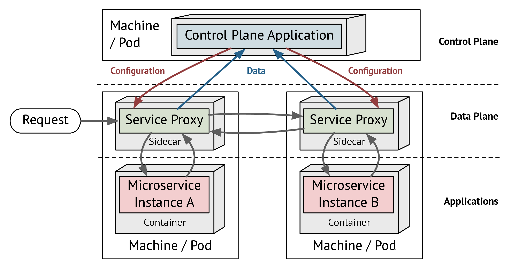

# What is a Service Mesh? {#chapter-what}

A Service Mesh is a dedicated infrastructure component that facilitates observing, controlling, and securing communication between services. Unlike earlier approaches such as Enterprise Service Buses (ESBs) or API Gateways, a service mesh embraces the distributed nature of modern microservice applications and only focuses on networking rather than business concerns. 

## Architecture

A Service Mesh is composed of two layers, the *data plane* and the *control plane*. The *data plane* consists of a a number of service proxies, each deployed alongside every microservice instance. This is called the *sidecar pattern*: Capabilities that every service needs are extracted to an additional container (the sidecar) that is placed next to every service instance. Up to now, typical use cases for a sidecar have been basic monitoring and encryption of network connections. Therefore, a service proxy was deployed as a sidecar which intersects all network traffic. The configuration of these service proxy sidecar containers and any update to it had to be performed manually. In a service mesh, the service proxies, that make up the data plane, are configured automatically by the second layer of a service mesh: the *control plane*. Any change to the behavior of the service mesh configured by the developer is applied to the control plane and automatically distributed to the service proxies. As shown in [figure 2.1](#fig-what-architecture), the *control plane* also processes telemetry data that is collected by the service proxies.

This architecture adds powerful features like monitoring, circuit breaking, canary releasing, and automatic mTLS (mutual TLS authentication) to a microservice application without the need to change a single line of application code.

{id="fig-what-architecture"}

## Service Mesh Interface {#section-what-interface}

The attention - or rather hype - has resulted is a multitude of service mesh implementations, each introducing different concepts and APIs. Meanwhile, a service mesh also turned out to be a suitable base for more advanced tools like

- [Flagger](https://flagger.app), for automating canary releasing, 
- [Squash](https://squash.solo.io), a debugging tool for running microservices, and
- [Kiali](https://www.kiali.io), a service mesh dashboard.

The diverse landscape of service mesh implementations forced tool developers and users to bind to a specific service mesh. This led Microsoft, HashiCorp, Buoyant, and Solo.io to create [Service Mesh Interface](https://smi-spec.io) (SMI), an API specification for service mesh features. Users and tools binding to SMI are able to use service mesh features independently of the implementation. Although SMI is still young, adapters implementing a part of SMI already exist for the three major service meshes Linkerd 2, Istio, and Consul.

